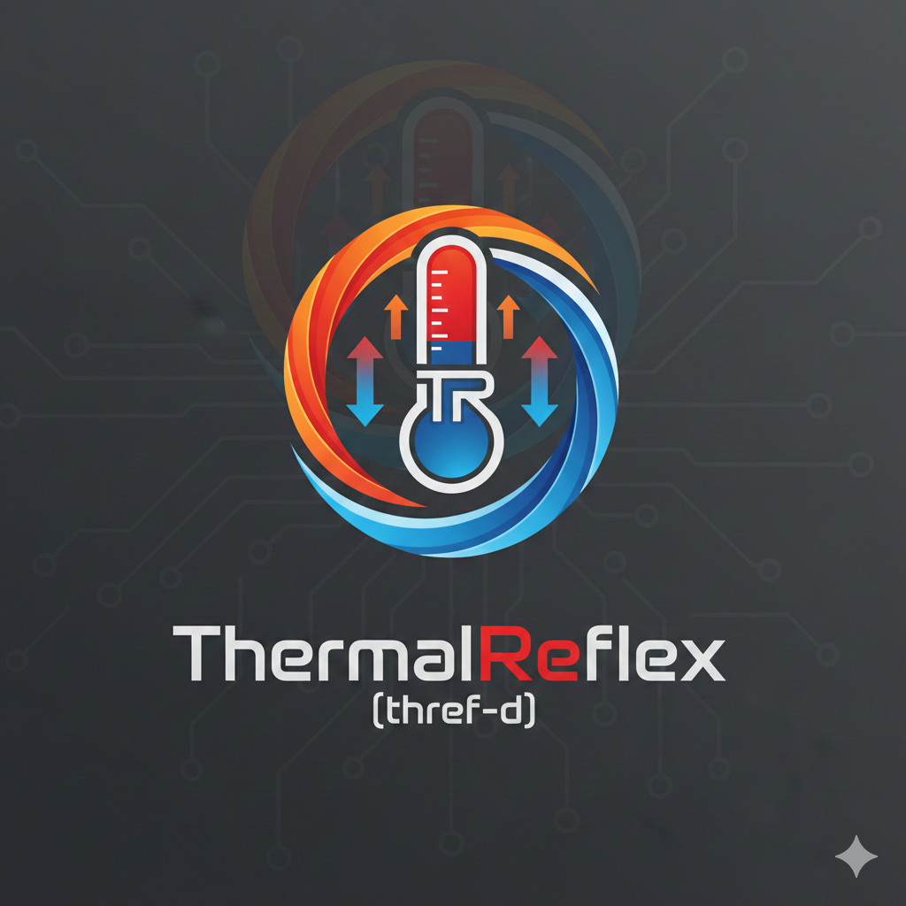

# ThermalReflex Daemon

Software written in C (standard 23) to monitor and respond to temperature on single-board computers.

<p align="center">
    
</p>

## Build

> **Note:** Requirements (install first): json-c, glib 2.0, wiringOP

After manually installing all the dependencies, call the ```build.sh``` script to build the daemon and place it in the systemd directory. After build it is required to create config at path ```/etc/thermal-reflex/config.json```. Use ```config.json.example``` as note.

## Launch

When config is created, service can be launched by ```systemctl start threfd```.